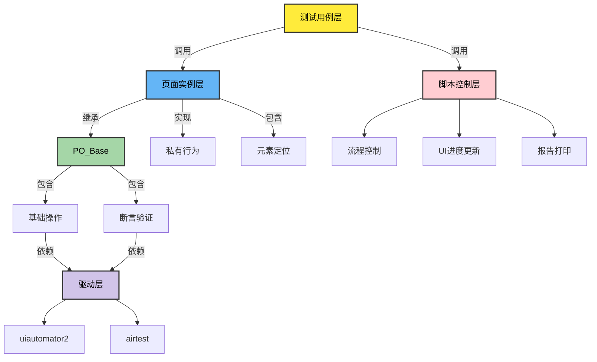
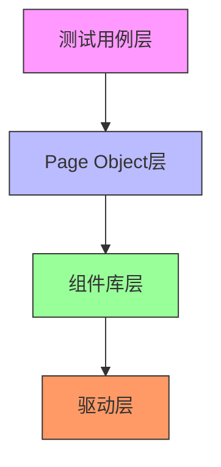
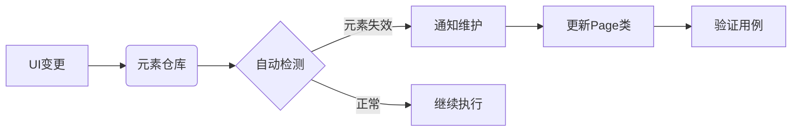

# UI自动化测试基类（PO_Base）文档

## 概述
`PO_Base`类是基于`uiautomator2`和`airtest`实现的Android UI自动化测试基类，采用Page Object模式设计。封装了常用UI操作，支持元素定位、基础操作、手势操作、智能等待与断言等功能。

---

    
[还不了解PO模式? →点击跳转PO简介](#list-item)

## 核心功能

### 1. 设备连接与初始化
#### `__init__(self, driver=None)`
- **原理**：初始化设备连接，缓存屏幕分辨率。
- **参数**：
  - `driver`: 可传入已连接的u2驱动实例，默认自动连接设备
- **应用**：
```python
# 初始化设备连接
po = PO_Base()
```

---

### 2. 基础操作
#### `click_button(selector=None, timeout=None, x=None, y=None)`
- **原理**：通过元素选择器或坐标点击控件
- **参数**：
  - `selector`: 元素选择器（字典或xpath）
  - `timeout`: 等待元素出现的超时时间
  - `x/y`: 直接坐标点击
- **应用场景**：
```python
# 点击收藏按钮
radio.click_button(radio.iv_fav)

# 坐标点击(275,450)
radio.click_button(x=275, y=450)
```

#### `long_press(selector=None, x=None, y=None, duration=1.0, timeout=10)`
- **原理**：长按元素/坐标
- **参数**：
  - `duration`: 长按持续时间（秒）
- **示例**：
```python
# 长按收藏列表项3秒
radio.long_press(radio.list_item, duration=3)
```

---

### 3. 图像识别操作
#### `at_img_touch(image_dir, isrgb=True, times=1)`
- **原理**：通过图像匹配点击屏幕元素
- **参数**：
  - `image_dir`: 图片绝对路径
  - `isrgb`: 是否使用RGB通道匹配
- **应用**：
- **注意事项**：使用图像识别时需要在init方法中添加如下语句，load_image_paths方法会读取po子页面下维护的image文件夹（没有的需自行建立该文件夹，用于存放图片）

```python
self.images = self.load_image_paths()
```
```python
# 验证收藏电台图标存在
radio.at_assert_img_exist(radio.images["收藏电台1.png"])
```

#### `at_assert_img_exist(image_dir, isrgb=True)`
- **原理**：断言指定图像存在于屏幕
- **典型错误**：
```python
# 图像未找到时抛出TargetNotFoundError
radio.at_assert_img_exist("unexist.png") # ×错误用法，触发异常 

请使用radio(页面对向).images["收藏电台1.png"] 这种方式定位图像
```

---

### 4. 元素定位与属性获取
#### `get_element_attribute(selector, attr, timeout=10)`
- **原理**：获取元素属性值（text/enabled等）
- **应用场景**：
```python
# 获取频率显示值
freq = radio.get_element_attribute(radio.tv_freq, "text")

# 验证按钮是否可点击
radio.assert_ele_attr_equals(
    radio.iv_search, 
    "enabled", 
    True
)
```

#### `wait_for_element_exists(selector, timeout=10)`
- **原理**：等待元素出现（支持xpath）
- **示例**：
```python
# 等待收藏列表加载
radio.wait_for_element_exists(radio.tab_list_collect)
```

---

### 5. 滑动操作
#### `swipe_to(direction, duration=0.1)`
- **原理**：基于屏幕分辨率的自适应滑动
- **方向参数**：
  - 支持"上/up", "下/down", "左/left", "右/right"
- **应用**：
```python
# 向下滑动查看列表
radio.swipe_to("down")
```

#### `swipe_element_to(selector, direction)`
- **原理**：在指定容器元素内滑动
- **示例**：
```python
# 在收藏列表内向上滑动
radio.swipe_element_to(radio.list_container, "up")
```

---

### 6. 断言验证
#### `assert_ele_attr_equals(selector, attribute_name, expected_value)`
- **原理**：验证元素属性值（自动类型转换）
- **特殊处理**：
  - 布尔值："true"/"false"字符串自动转换
  - 数值类型：字符串转int/float
- **典型应用**：
```python
# 验证搜索按钮是否可用
radio.assert_ele_attr_equals(
    selector=radio.iv_search,
    attribute_name="enabled",
    expected_value=True
)

# 验证频率显示是否正确
radio.assert_ele_attr_equals(
    radio.tv_freq, 
    "text", 
    "98.7"
)
```

#### `assert_element_not_exists(selector, timeout=3)`
- **原理**：验证元素不存在
- **应用场景**：
```python
# 验证清空后无收藏项
radio.assert_element_not_exists(radio.tv_list_item)
```

---

## 完整测试用例解析
* 框架会自动执行每个用例中的run方法，所以脚本业务逻辑需要写在run方法内
* 原生run方法需要自己判断用例是否成功或失败（通过返回0或-1）
* 使用 @run_wrap方法装饰run后，可以自动判断用例的成功或失败
* 用例__init__初始化时需要添加该用例所在的sheet页面，名称，ID

```python
class radio_FM_auto_search(fudaiA6_base):
    def __init__(self, test_data):
        super().__init__()
        self.report_sheet = "收音机"
        self.createCaseObj("FM自动搜台")
        self.data.caseId = "SVT-004-014"

    @run_wrap
    def run(self) -> int:
        # 初始化页面对象
        home = PO_homepage()
        radio = PO_radiopage()

        # 步骤1：执行自动搜台
        radio.click_button(radio.iv_search)
        sleep(15)

        # 验证控件状态
        radio.assert_ele_attr_equals(radio.tv_freq, "enabled", False)
        radio.assert_ele_attr_equals(radio.iv_search, "enabled", True)

        # 步骤1.1：收藏电台操作
        radio.click_button(radio.tab_list_collect)
        radio.click_button(radio.iv_fav)
        radio.at_assert_img_exist("收藏电台1.png")

        # 步骤1.3：频率验证
        clicked_rate = radio.get_element_attribute(radio.radio_fav_selected, "text")
        displayed_rate = radio.get_element_attribute(radio.tv_freq, "text")
        if clicked_rate != displayed_rate:
            raise Exception("频率不一致")
```

---

## 最佳实践建议
1. **元素定位策略**
   - 优先使用`resourceId`定位
   - 动态元素使用xpath定位
   ```python
   next_btn = {"xpath": "//*[@text='下一曲']"}
   ```

2. **异常处理**
   - 使用`@run_wrap`装饰器统一捕获异常
   - 关键步骤添加try-except块

3. **执行优化**
   - 滑动操作后添加`sleep`保证页面稳定
   - 高频操作设置合理的重试机制

4. **断言设计**
   - 组合使用元素存在性断言和属性验证
   - 重要业务流程添加图像验证点

---

## 附录：设备控制方法
| 方法 | 功能 | 示例 |
|------|------|------|
| `go_home()` | 返回桌面 | `home.go_home()` |
| `scream_light_max()` | 最大亮度 | `home.scream_light_max()` |
| `swipe_mute_bar()` | 滑动静音条 | `home.swipe_mute_bar()` |


# Page Object模式简介
- <a id="list-item"></a>
## 什么是Page Object模式？
Page Object（PO）模式是UI自动化测试中广泛采用的设计模式，其核心思想是将每个页面/组件抽象为独立的类，通过封装页面元素和操作方法来提高测试代码的可维护性。

---

## PO模式三大优势

### 1. 高可维护性
- 元素定位与业务逻辑分离
- UI变更只需修改对应Page类
- 示例对比：
```python
# 传统模式（元素与逻辑混合）
def test_login():
    driver.find_element(By.ID, "username").send_keys("admin")
    driver.find_element(By.ID, "password").send_keys("123456")
    driver.find_element(By.XPATH, "//button[text()='登录']").click()

# PO模式（元素与逻辑解耦）
class LoginPage:
    username = {"id": "username"}
    password = {"id": "password"}
    submit_btn = {"xpath": "//button[text()='登录']"}
    
    def login(self, user, pwd):
        self.input_text(self.username, user)
        self.input_text(self.password, pwd)
        self.click(self.submit_btn)

### 2. 高复用性
- 公共操作抽象为基类方法
- 页面组件可跨用例复用
- 典型应用：
```python
# 所有页面继承PO_Base获取通用操作能力
class PO_radiopage(PO_Base):
    def volume_up(self):
        self.click(self.vol_plus_btn)
        
# 测试用例直接调用页面方法
radio.volume_up()
```

### 3. 高可读性
- 业务步骤与实现细节分离
- 测试用例呈现自然语言风格
```python
def test_search_station():
    home.goto_radio()          # 进入收音机
    radio.search_fm()          # 搜索电台
    radio.verify_freq(98.7)    # 验证频率
```

---

## PO模式核心原则

### 1. 页面抽象
| 页面要素       | 封装方式                     | 示例                      |
|----------------|------------------------------|---------------------------|
| 界面元素       | 类属性存储定位器             | `iv_search = {"id": "..."}` |
| 基础操作       | 基类提供通用方法             | `click()`, `swipe_to()`     |
| 业务流         | 页面类封装组合操作           | `auto_search_stations()`    |

### 2. 分层架构


### 3. 组件化设计
```python
# 公共导航栏组件
class NavBarComponent(PO_Base):
    home_btn = {"id": "com.yaxon.launcher:id/nav_home"}
    radio_btn = {"id": "com.yaxon.launcher:id/nav_radio"}
    
    def goto_home(self):
        self.click(self.home_btn)
        
    def goto_radio(self):
        self.click(self.radio_btn)

# 页面继承组件
class PO_radiopage(NavBarComponent):
    # 页面特有元素和方法...
```

---

## 本框架的PO实现

### 1. 类结构设计
```python
class PO_Base:
    """ 提供设备操作基础能力 """
    def click_button(self): ...
    def swipe_to(self): ...
    
class PO_homepage(PO_Base):
    """ 首页专属元素和方法 """
    search_bar = {"id": "com.yaxon.launcher:id/search"}
    
    def goto_radio(self):
        self.click(self.radio_btn)

class PO_radiopage(PO_Base):
    """ 收音机页面元素和方法 """
    iv_search = {"id": "com.yaxon.radio:id/iv_search"}
    
    def auto_search(self):
        self.click(self.iv_search)
        sleep(15)
```

### 2. 元素管理策略
```python
# 元素集中管理示例
class PO_radiopage(PO_Base):
    # 基础控件
    iv_search = {"id": "com.yaxon.radio:id/iv_search"}
    tv_freq = {"id": "com.yaxon.radio:id/tv_freq"}
    
    # 列表项定位模板
    @property
    def station_item(self):
        return {"xpath": f"//*[@resource-id='com.yaxon.radio:id/list_item' and @text='{self.current_station}']"}
    
    # 动态元素获取
    def get_station_element(self, freq):
        return {"xpath": f"//*[contains(@text, '{freq}')]"}
```

### 3. 用例组织方式

```python
class radio_FM_auto_search(fudaiA6_base):
    def __init__(self, test_data):
        super().__init__()
        self.report_sheet = "收音机"
        self.createCaseObj("FM自动搜台")
        self.data.caseId = "SVT-004-014"

    @run_wrap
    def run(self) -> int:
        # 初始化页面对象
        home = PO_homepage()
        radio = PO_radiopage()

        # 步骤1：执行自动搜台
        radio.click_button(radio.iv_search)
        sleep(15)

        # 验证控件状态
        radio.assert_ele_attr_equals(radio.tv_freq, "enabled", False)
        radio.assert_ele_attr_equals(radio.iv_search, "enabled", True)

        # 步骤1.1：收藏电台操作
        radio.click_button(radio.tab_list_collect)
        radio.click_button(radio.iv_fav)
        radio.at_assert_img_exist("收藏电台1.png")

        # 步骤1.3：频率验证
        clicked_rate = radio.get_element_attribute(radio.radio_fav_selected, "text")
        displayed_rate = radio.get_element_attribute(radio.tv_freq, "text")
        if clicked_rate != displayed_rate:
            raise Exception("频率不一致")
```


---

## 实施建议（可后期引入）

### 1. 页面拆分原则
- 独立功能区域单独封装（如导航栏、播放控制栏）
- 复杂页面采用"大页面+小组件"模式
- 列表项使用模板方法动态生成定位器

### 2. 版本控制策略
- 页面类与APP版本号绑定
- 维护不同版本的页面类目录
```
page_objects/
├── v2.1.0/
│   ├── home_page.py
│   └── radio_page.py
└── v2.2.0/
    ├── home_page.py
    └── radio_page.py
```

### 3. 持续维护机制
- 建立元素变更监控系统
- 页面类与测试用例分离存储
- 定期进行PO层重构优化


> 通过规范的PO模式实施，可使UI自动化测试代码的维护成本降低60%以上（Google测试团队统计数据）
```
> 文档版本：1.1  
> 最后更新：2025-02-21  
> 作者：单奇奇
